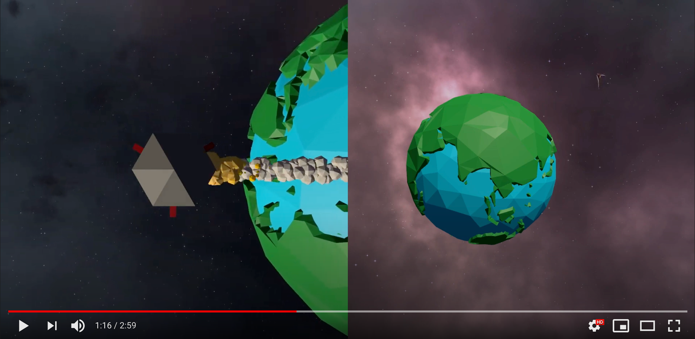

# pem-ki
Development of Media Systems: AI Applications - Group project (2021)
- Final pitch [.pdf](./docs/2020-03-05%20PEM-KI%20Final%20pitch.pdf), Concept [.pdf](./docs/2021-02-24%20PEM-KI%20Concept.pdf)
- Live WebGL demo [https://github.andreasellwanger.com/pem-ki/](https://github.andreasellwanger.com/pem-ki/)

- [pem-ki](#pem-ki)
  - [Getting Started](#getting-started)
    - [Requirements](#requirements)
    - [Assets](#assets)
  - [Contributors](#contributors)
    - [Individual contributions](#individual-contributions)

## Getting Started
Open the [`iRocketLanding24`](./iRocketLanding24) folder in Unity.
### Requirements
- Unity 2019.4.20f1 (LTS) [`unityhub://2019.4.20f1/6dd1c08eedfa`](unityhub://2019.4.20f1/6dd1c08eedfa)
- ml-agents [https://github.com/Unity-Technologies/ml-agents](https://github.com/Unity-Technologies/ml-agents)
- Python 3.7.9
- tensorboard
- Unity collab
  
### Assets
- [Low Poly Rocket](https://assetstore.unity.com/packages/vfx/particles/low-poly-rocket-trail-75911) _paid_
- [Low Poly Planet Pack](https://assetstore.unity.com/packages/3d/planets-pack-72089) _paid_
- [Starfield Skybox](https://assetstore.unity.com/packages/2d/textures-materials/sky/starfield-skybox-92717) _free_

## Contributors

- Andreas Ellwanger
- Andreas Griesbeck
- Thanh Le
- David Schmider

### Individual contributions

Due to the small group size of 4, it is impossible for us to properly distinguish what of our project has been done by whom. We all worked on all parts of our application, especially since we mostly did "pair-programming" (with two or often all four of us working together). So all of us were equally involved in all parts of our application. We would be happy to answer questions about our development process and our individual/collective contributions at the examination.
